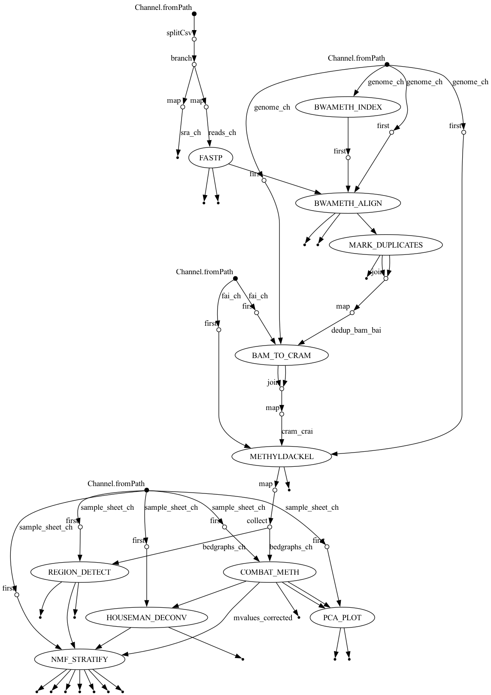

# SLE Methylation Pipeline

End-to-end Nextflow DSL2 pipeline for Systemic Lupus Erythematosus (SLE) bisulfite sequencing analysis.

FASTQ → alignment → methylation calling → batch correction → cell deconvolution → DMR detection → patient stratification

## Pipeline DAG



## Pipeline Stages

| Stage | Tool | Description |
|-------|------|-------------|
| QC + trimming | fastp | Adapter trimming, quality filtering, QC reports (single process) |
| Alignment | bwa-meth | Bisulfite-aware alignment to hg38 |
| Deduplication | Picard MarkDuplicates | Mark and remove PCR duplicates |
| CRAM conversion | samtools | BAM → CRAM (40–60% smaller) |
| Methylation calling | MethylDackel | Per-CpG methylation extraction + M-bias reports |
| Batch correction | ComBat-meth | Methylation-specific batch correction (beta regression, Wang 2025) |
| PCA | R/ggplot2 | Raw and corrected PCA plots by batch and condition |
| Cell deconvolution | Houseman/quadprog | Blood cell type fraction estimation (Salas 2018 IDOL reference) |
| DMR detection | dmrseq | Count-level DMR detection with permutation p-values (Korthauer 2019) |
| Patient stratification | NMF | Unsupervised subtype discovery with rank selection, LOO stability, cell-type regression |

## Prerequisites

### Nextflow (requires Java 11+)

```bash
curl -s https://get.nextflow.io | bash
mv nextflow ~/bin/   # or /usr/local/bin/
```

### Micromamba

```bash
# macOS
brew install micromamba

# Linux
"${SHELL}" <(curl -L micro.mamba.pm/install.sh)
```

Nextflow creates per-process conda environments automatically using micromamba. No manual environment setup is needed.

### Reference genome

```bash
wget https://ftp.ncbi.nlm.nih.gov/genomes/all/GCA/000/001/405/GCA_000001405.15_GRCh38/seqs_for_alignment_pipelines.ucsc_ids/GCA_000001405.15_GRCh38_no_alt_analysis_set.fna.gz
gunzip GCA_000001405.15_GRCh38_no_alt_analysis_set.fna.gz
mv GCA_000001405.15_GRCh38_no_alt_analysis_set.fna hg38.fa
samtools faidx hg38.fa
```

## Quick Start

### Test profile (simulated chr22, ~13s with cache)

```bash
nextflow run main.nf -profile test,conda
```

### Local run with real data

```bash
nextflow run main.nf \
    -profile local,conda \
    --sample_sheet samples.csv \
    --genome /path/to/hg38.fa \
    --outdir results
```

### Skip alignment (start from existing bedGraphs)

```bash
nextflow run main.nf -profile local,conda \
    --sample_sheet samples.csv \
    --genome /path/to/hg38.fa \
    --skip_alignment true \
    --outdir results
```

### HPC (SLURM)

```bash
nextflow run main.nf -profile slurm,conda \
    --sample_sheet samples.csv \
    --genome /path/to/hg38.fa \
    --outdir results
```

### AWS Batch (Spot instances)

```bash
nextflow run main.nf -profile aws \
    --sample_sheet s3://bucket/samples.csv \
    --genome s3://bucket/hg38.fa \
    --outdir s3://bucket/results
```

Profiles are composable. Always pair an executor (`local`, `slurm`, `aws`, `gcloud`) with an environment (`conda`, `docker`, `singularity`). Cloud profiles require editing `nextflow.config` for your project/bucket/queue names.

## Sample Sheet Format

```csv
sample_id,fastq_1,fastq_2,condition,batch
SRR22476697,/data/SRR22476697_1.fastq.gz,/data/SRR22476697_2.fastq.gz,SLE,batch1
SRR22476701,/data/SRR22476701_1.fastq.gz,/data/SRR22476701_2.fastq.gz,control,batch1
```

SRA accession rows are supported: set `fastq_1` to the SRR ID and leave `fastq_2` empty. Both modes can be mixed. SRR rows are auto-detected and routed through `FETCH_SRA`; local rows go straight to QC.

## Output Structure

```
results/
├── fastp/                  # QC HTML/JSON reports + trimmed FASTQs
├── crams/                  # Sorted, deduplicated CRAMs + CRAI indices
├── methyldackel/           # Per-CpG bedGraphs + M-bias PNGs
├── combat_meth/            # Batch-corrected M-value matrix + beta RDS
├── pca/                    # 4 PNGs: {raw,corrected} × {batch,condition}
├── houseman/               # Cell type fraction TSV + bar plot
├── region_detect/          # Candidate DMR BED + manhattan plot
├── nmf/                    # Cluster TSV, W/H matrices, rank selection, heatmaps, LOO stability
└── pipeline_info/          # Nextflow timeline, report, trace.txt, DAG
```

## Crash Recovery and Resumption

Resume is on by default (`resume = true` in `nextflow.config`). Completed tasks are fingerprinted and skipped on re-run. Processes retry up to 3 times on exit codes 137 (OOM), 143 (SIGTERM), 247 (OOM), or null (Spot host termination). Each retry doubles memory and adds CPUs.


## Dataset

Validation cohort: [SRP410780](https://www.ncbi.nlm.nih.gov/sra/?term=SRP410780) — 11 whole-genome bisulfite sequencing samples (4 SLE, 3 Sjogren's, 4 healthy controls).

A 6-sample subset (`sampleSheets/samples_chr19.csv`) with 3 SLE + 3 Control balanced across 2 batches is used for local runs. The full 11-sample cohort (4 SLE, 3 Sjogren's, 4 Control) is available via `sampleSheets/samples_full.csv`.

This dataset validates all code paths but is underpowered for biological discovery (n=11). The goal is to expand to 50+ samples across diverse ethnicities — SLE disproportionately affects Black, Hispanic, and Asian populations, and cohort composition must reflect this.

## Key Design Choices

- ComBat-meth (Wang 2025, NAR Genomics & Bioinformatics) for batch correction — uses beta regression on bounded [0,1] values, not gene expression-targeted `sva::ComBat`
- M-values (logit of beta) for all statistical and ML analyses; beta values retained for Houseman deconvolution only
- Houseman deconvolution via quadprog (constrained least-squares) against the Salas 2018 IDOL 450-CpG reference panel — avoids minfi/Bioconductor compilation failures in conda
- dmrseq for DMR detection — count-level model with permutation p-values, batch as covariate; runs in parallel with ComBat-meth (both consume raw bedGraphs)
- NMF rank selection uses cophenetic correlation + dispersion + silhouette together; sweep k=2..8, 30–50 runs per rank
- NMF enhancements: (1) Houseman cell fractions regressed out before clustering to prevent cell-proportion-driven subtypes; (2) DMR-based CpG feature selection (fallback to top-variance if fewer than 500 DMR CpGs found); (3) leave-one-out stability analysis across all n iterations
- Optional `--clinical_metadata` TSV correlates H-matrix factor weights with numeric clinical variables (SLEDAI, age, etc.)
- VDJ locus DMRs flagged with `vdj_risk=TRUE` — immune receptor loci undergo somatic recombination that mimics differential methylation
- Per-module conda environments managed automatically by Nextflow + micromamba; no manual setup required

## SOTA Alternatives Worth Considering

These are credible upgrades for a larger cohort or production deployment. Each represents a meaningful capability or performance improvement over the current stack.

### Alignment: bwa-meth → biscuit or HISAT-3N

**biscuit** (Zheng et al., *Bioinformatics* 2024) performs bisulfite alignment and methylation extraction in a single tool, with simultaneous SNP calling. Useful for allele-specific methylation (ASM) and eQTL/mQTL integration. Substantially faster on large cohorts; pileup output replaces MethylDackel.

**HISAT-3N** (Zhang et al., *Genome Research* 2021) is a three-nucleotide-conversion-aware spliced aligner from the HISAT2 team. Relevant if the analysis ever extends to RNA bisulfite sequencing (m6A or pseudouridine profiling alongside DNA methylation).

### Deduplication: Picard → sambamba markdup

**sambamba** (Tarasov et al., *Bioinformatics* 2015) is 3–5× faster than Picard MarkDuplicates and parallelizes natively. Drop-in replacement for coordinate-sorted BAMs; reduces wall time on the dedup step from ~30 min to ~7 min per sample on 4 cores.

### Batch correction: ComBat-meth → RUVm or HarmonizeME

**RUVm** (Maksimovic et al., *Genome Biology* 2015) estimates unwanted variation from negative control probes or empirical controls — more principled than batch label-based correction when batch identity is partially confounded with disease status. Better suited when you cannot guarantee balanced batch × condition designs.

**HarmonizeME** (Planell et al., *Briefings in Bioinformatics* 2023) extends ComBat to multi-study integration with reference batch anchoring. Useful for the 50+ sample expansion when combining multiple SRA cohorts collected under different protocols.

### Cell deconvolution: Houseman → EpiDISH or MethylResolver

**EpiDISH** (Teschendorff et al., *Bioinformatics* 2017) supports a wider panel of cell types (granulocytes, NK cells, monocyte subtypes) and provides both constrained projection (RPC) and CIBERSORT-style (CBS) modes. The Epidish reference panel covers 7 cell types vs. 6 in Salas 2018 IDOL, and is actively maintained for EPIC array compatibility.

**MethylResolver** (Reed et al., *Communications Biology* 2020) uses a penalized regression approach and is more robust when reference and query platforms differ (e.g., mixing RRBS cohorts with WGBS).

### DMR detection: dmrseq → DSS + DMRfinder or metilene

**DSS** (Feng et al., *Nucleic Acids Research* 2014; Wu et al., 2015) uses a Bayesian hierarchical model with dispersion shrinkage — better calibrated p-values at small n. At n=11, dmrseq's permutation approach has low power; DSS's shrinkage model is more appropriate. DSS + DMRfinder is a standard small-cohort combination.

**metilene** (Jühling et al., *Genome Research* 2016) is C++ based and orders of magnitude faster than R-based methods. Designed for whole-genome scale; returns variable-width DMRs with q-values. Worth considering for the 50+ sample expansion where dmrseq run time becomes prohibitive (>6 hours per full genome run).

### Patient stratification: NMF → MOFA+ or Mefisto

**MOFA+** (Argelaguet et al., *Genome Biology* 2020) is a probabilistic multi-omics factor analysis framework. When methylation is combined with gene expression or proteomics from the same cohort, MOFA+ jointly decomposes both modalities — NMF cannot. Bayesian inference gives proper uncertainty estimates on factor loadings; useful for small n.

**Mefisto** (Velten et al., *Nature Methods* 2022) extends MOFA+ to spatiotemporal structure — relevant if longitudinal samples (multiple flares per patient) become available.

### QC aggregation: add MultiQC

**MultiQC** (Ewels et al., *Bioinformatics* 2016) aggregates fastp, Picard, MethylDackel M-bias, and flagstat reports into a single interactive HTML. Add as a terminal process consuming all QC outputs via `.collect()`. A one-process addition with high value for cohort QC review.

## Companion: ImmuneMethylTools

[ImmuneMethylTools](https://github.com/ChristopherSNelson/ImmuneMethylTools) is a pre-alignment QC framework for immune-cell methylation studies. It provides upstream quality gates that run before this pipeline's alignment stage:

- Bisulfite conversion QC — flags samples with non-CpG methylation rate >1% (incomplete conversion)
- Sample contamination detection — identifies muddy beta distributions via Sarle's Bimodality Coefficient
- Batch × disease confound check — Cramér's V test to detect batch-confounded designs before batch correction absorbs biological signal
- VDJ clonal artifact masking — detects and masks CpGs in immune receptor loci where somatic recombination creates artifactual methylation signals

Together, the two tools form a full QC → analysis workflow for autoimmune WGBS cohorts.

## License

MIT
